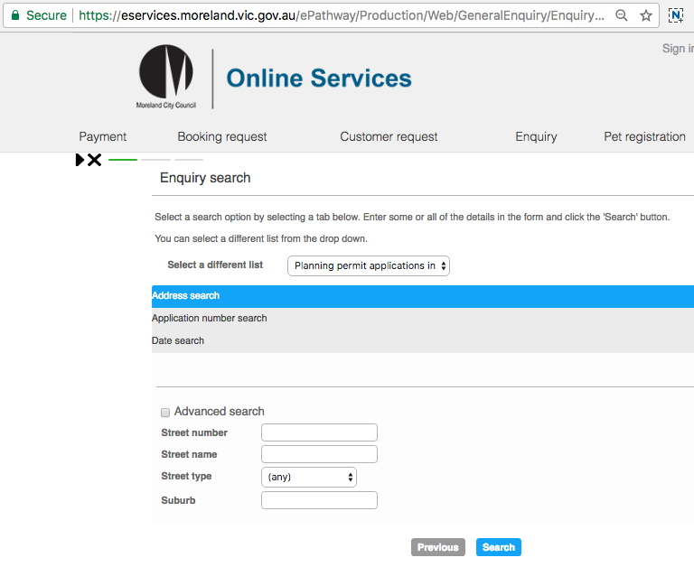

# Intro

I'm trying to scrape planning applications in Moreland Council (Melbourne, Victoria) that have been decided on.  This I reckon would complement the Planning Alerts scraper that already exists (that scrapes newly advertised planning alerts only).

However, I'm struggling to navigate to the exact page I need.

## Planning Permit decisions

There is a page which lists, in an HTML table, all the planning permits the council has ruled on.  

Getting to this page from the form, should be as simple as selecting `planning permit decisions` in the dropdown then hitting the `Search` button.  Apparently not

For any other value in the dropdown, I can navigate forwards using `Mechanize`.  But not with the dropdown option `planning permit decisions`.  

Really need some help as to what I'm doing wrong.

Thanks